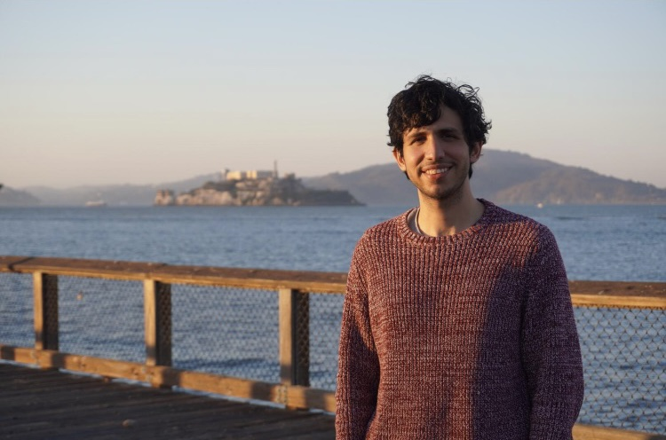

# Bio

<figure><figcaption>
 😄 (2022)
</figcaption></figure>

Hello! I'm Juan Huerta, a CS, Math, Physics, and Music graduate, specializing in AI and machine learning. My professional journey focused on emerging technology and exploring artificial intelligence solutions for diverse applications. My passion lies in interdisciplinary research and exploring novel tools and techniques, subjecting them to scientific evaluation. I am particularly interested in researching algorithms and software architectures that continuously learn and improve without requiring extensive manual intervention. Additionally, I like to focus on settings with temporal data, like music, audio, or general data streams.

I'm currently at The Walt Disney Company, serving as a Senior Software Engineer in Machine Learning. In this role, I research emerging ML techniques and led the development of innovative solutions to enhance Disney's experiences, products, and services.&#x20;

\
