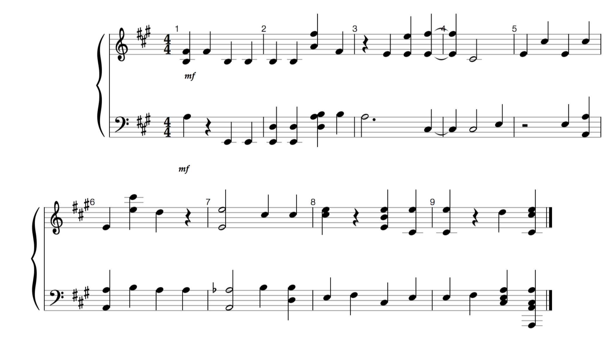

# AMCC

### Automatic Music Composition and Completion

We introduce a novel symbolic method for automated music composition. Our process begins by compiling a dataset comprising 62 hours of Mozart's music represented in binary piano roll arrays. Leveraging this dataset, we train a 1-hidden layer neural network (essentially Logistic Regression with a non-linear activation). This network is trained to predict a segment of music based on its contextual surroundings within the composition.

Post-training, our model continuously predicts and substitudes sections within existing music. This transformation results in what we perceive as newly composed music. This modeling approach draws parallels with skipgram models by capturing contextual dependencies in music sequences. Its advantage lies in imitating high-level musical structural features, effectively addressing the challenge of long sequence dependencies and maintaining an awareness of the overall music structure in a simple manner.

### Introduction

***

In this post, we aim to create music employing a symbolic representation that offers clarity and low computational cost while ensuring sufficient variation and global structure. However, unlike the conventional method of music generation utilizing sequence modeling mechanisms, we'll adopt an alternate approach. Our strategy involves generating new music by altering an existing sequence. To achieve this, we'll train a neural network to predict a missing section of music based on the surrounding context. Following the training phase, we'll utilize our model to predict and replace sections within the existing music.

### Method

***

The neural network architecture we've chosen incorporates only a single hidden layer. This decision aims to distill compositional insights, focusing more on learning general harmonic patterns rather than nuanced stylistic elements. As we proceed, we'll assess the model's performance and adapt if necessary. Our model is an adaptation of the Continuous Bag of Words Model (CBWM) by Mikolov et al., modified for the many-hot case. A key modification involves replacing the CBWM's last softmax layer with a sigmoid layer featuring N outputs. This adjustment allows separate predictions for each note on the piano roll. The input layer receives a binary vector representing a musical section, and the objective is to predict the middle section of music. Refer to the visualization below for a detailed depiction of the training process.

<figure><figcaption>
Diagram Representation of the predictive process for AMCC
</figcaption></figure>

### Results

***

#### Comparisons input-output


Video demo transforming music from various different composers&#x20;


#### Example 1 (Edvard Grieg)

Below we show a few results. The sheet music represents the generated section at approximately at 5:09

**Original**



**Generated**



<figure><figcaption>
Sheet music for output example min 5:09
</figcaption></figure>

\
\
