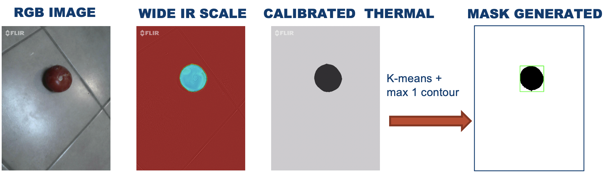
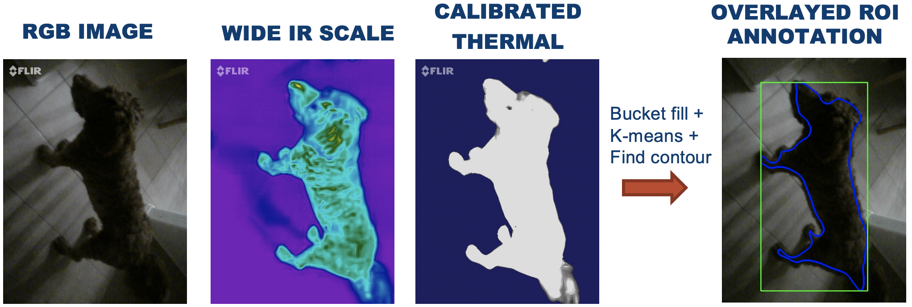

# Auto-labeling with Thermal Camera

<figure><figcaption></figcaption></figure>

### Automate Data Labeling using Temperature Differential

Data labeling for object detection/segmentation often incurs substantial expenses. In this discussion, we delve into an innovative approach to expedite this process, leveraging thermal cameras alongside conventional computer vision techniques. The crux of this method involves aligning a regular camera with a thermal camera. By doing so, we can generate annotations such as masks or Region of Interest (ROI) annotations based on temperature differentials observed.

This methodology does come with certain limitations and prerequisites. Precise alignment between the regular and thermal cameras is necessary, and it's essential to ensure consistent environmental conditions for accurate annotations. Despite these requirements, numerous use cases can capitalize on this approach, offering an efficient means to bootstrap computer vision models. The fusion of thermal and visual data not only expedites data labeling but also provides a novel and valuable perspective for enhancing object detection accuracy.



### Introduction

***

While numerous computer vision datasets are readily available, custom object recognition often requires manual data collection and labeling. Data labeling can be both time-consuming and costly. For an illustration of the standard annotation process, refer to the visualization below:

<figure><figcaption></figcaption></figure>

In this post, I present a novel method that offers two distinct applications:

1. Accelerating the object labeling process to facilitate training for supervised computer vision models.
2. Object localization coupled with a classification model, forming a hybrid object detection approach. This hybrid approach proves beneficial in fixed camera scenarios, such as refrigerator cameras, parking lot cameras, security cameras, and similar setups.

This method comes with certain prerequisites. It operates effectively in settings where the objects of interest exhibit a noticeable temperature difference. Such scenarios include living organisms, stove-top cooking, ovens, and items that can be deliberately cooled before data collection.

The [Flir-camera](https://www.amazon.com/FLIR-ONE-Pro-Professional-Smartphones/dp/B072J49BX7/ref=sr\_1\_3?keywords=FLIR%2BInfrared%2BCamera\&qid=1641504646\&sr=8-3\&th=1) is recommended for its capability to capture images with both RGB and Thermal sensors. Other thermal cameras can be used, but achieving precise alignment between the different lenses is essential for accurate calibration between the two types of images.

### Method

***

The method consists of the following steps.

**Step 1**: Fix the Flir thermal/RGB camera

* It is possible to skip this step and take handheld images however you will need to be careful with your calibration.

**Step 2**: Specify expected temperature of item of interest

* For example:  _**`10C`**` ``< temp <`` `**`30C`**_   or   _`temp >`` `**`30C`**_&#x20;

**Step 3**: Run

* Apply thermal image postprocessing to obtain localization of objects: \
  _`Bucket fill``  `**`->`**` `` ``K-means``  `**`->`**`  ``Find contour`_
* Extract RGB image using python
* Store RGB image and labeled image in desired format ROI key-points or PNG Mask

### Stove Top Examples

***

In this example, we're applying our proposed method to cooking food. This setting provides us with a very natural temperature differential, as the pan is typically hotter than the food. However, it's important to note that while this scenario offers a clear contrast, there are exceptions. This method isn't universally applicable to all settings; otherwise, neural nets might not be necessary!&#x20;

<figure><figcaption></figcaption></figure>

### Cooling Down Objects

***

In this scenario, we're applying our proposed method to items that have been left in the fridge for a few minutes. This setup naturally creates the required temperature differential. This method is effective for various items, although there's a time constraint as these items gradually warm up.

<figure><figcaption></figcaption></figure>

### Humans or Animals

***

In contrast, mammals typically have a body temperature that exceeds the surrounding environment, making our method naturally applicable in such scenarios, as seen in examples like people counting or pet detection.

<figure><figcaption></figcaption></figure>

### Conclusion

***

Expediting the data labeling process for object detection and segmentation, as explored in this discussion, stands as a substantial cost-saving measure. Leveraging thermal cameras in tandem with traditional computer vision techniques offers an innovative solution to this laborious task. While this method comes with prerequisites and limitations, its potential impact cannot be overlooked. Aligning visual and thermal data not only expedites labeling but also enriches computer vision systems with a unique perspective. From people counting to pet detection and beyond, this fusion of data provides a valuable resource for enhancing the accuracy of object detection models.

These examples are just the tip of the iceberg. Our provided code allows for experimentation with various settings, potentially saving countless hours otherwise spent on manual data labeling. By adopting these techniques, one can revolutionize the data annotation process, offering an efficient means to boost computer vision systems' accuracy and efficiency.

\
