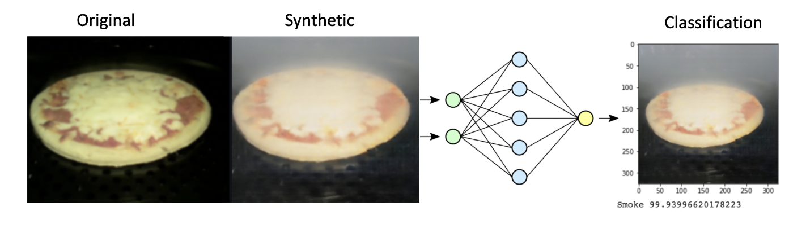
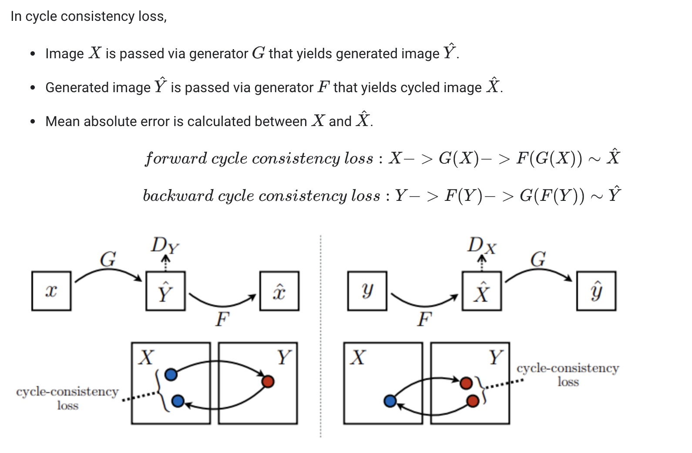
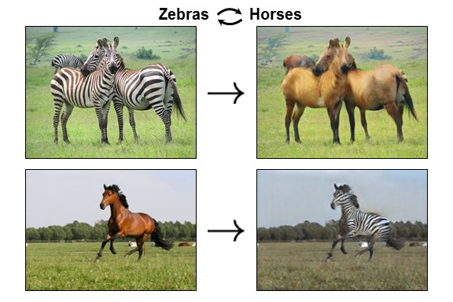
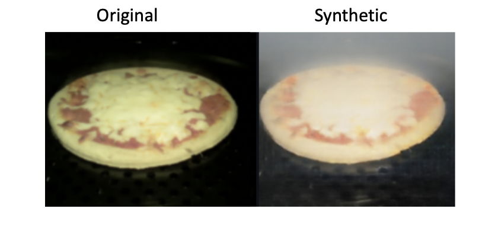

# CycleGANs Applications

### CycleGAN for Synthetic Image Generation

CycleGAN, a type of generative adversarial network (GAN), is adept at translating images across diverse domains without needing matched pairs. It involves training two mappings—translating images from one domain to another and vice versa—using adversarial learning. Employing CycleGAN, a generative adversarial network (GAN), we generate synthetic smoky oven images, bypassing the risks associated with collecting real smoke data in dangerous environments.

&#x20;In this project, we utilize two models: 1) a CycleGAN model for synthetic image generation, and 2) an image classification model aimed at detecting smoke in images. The evaluation of the classification model involves testing it with real smoke instances, serving as a demonstration of the efficacy of the CycleGAN synthetic image generation technique.



### Synthetic data

***

Synthetic data, including synthetic images, is artificially created information used to train models or fill in gaps in datasets where real data might be limited or hard to obtain. It's crafted by algorithms to resemble real-world data and can assist in improving the performance and robustness of machine learning models. In this discussion, we focus on altering existing images, a method within synthetic data creation, rather than generating entirely new images.

<figure><figcaption>
Demonstration of full pipeline, generating smoky images, and detecting smoke
</figcaption></figure>

### CycleGANs

***

CycleGAN, a type of generative adversarial network (GAN), is adept at translating images across diverse domains without needing matched pairs. It involves training two mappings—translating images from one domain to another and vice versa—using adversarial learning. The generator network transforms images between domains, while the discriminator network distinguishes between generated and real images in the target domain. Below is is a summary of the proces mathematically:&#x20;

<figure><figcaption></figcaption></figure>

The common example given is one in which we convert horses to zebras and vice versa

<figure><figcaption></figcaption></figure>

### Synthetic data results

***

Below are randomly chosen examples from a validation set. Observe how the output realistically represents smoke, particularly how it's distributed around the pizza, affirming that our model has effectively captured intricate aspects of this distribution.

<figure><figcaption></figcaption></figure>

### Classifying smoky images

***

We utilize a pre-trained ResNet-50 model to classify smoky images versus non-smoky ones, sourced from the Fire-Smoke-Detection folder, adapted from the [smoke-detection-repository](https://github.com/imsaksham-c/Fire-Smoke-Detection). Our evaluation involves converting 500 food images captured above a stovetop, divided into an 80/20 split for training and validation. The validation phase demonstrates an impressive \~96% performance score.

