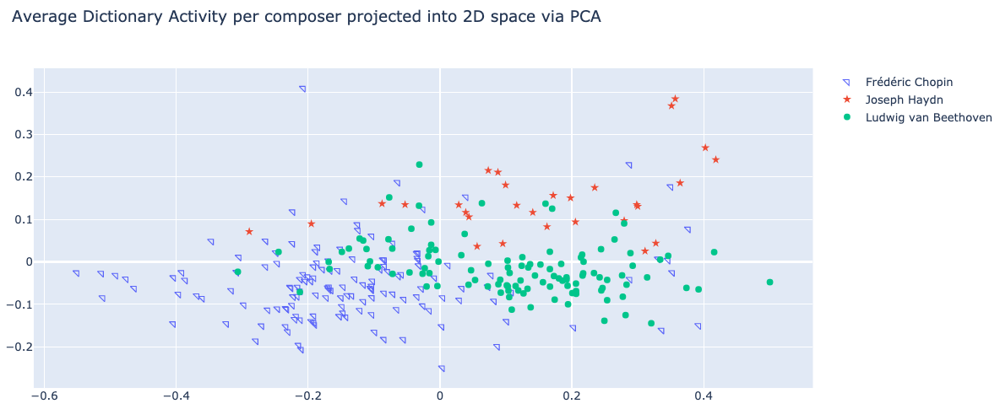

# Shift-Invariant Dictionary Learning

### Shift-Invariant Dictionary Learning using Temporal CONV-WTA Autoencoders for Discovering Music Relations

The temporal structure of music is full of shift-invariant patterns (e.g. motifs, ostinatos, loops, etc.). We propose using a Temporal Convolutional Winner-Take-All (CONV- WTA) autoencoder to find a shift-invariant dictionary to represent symbolic, multivariate, musical signals. The model learns to represent fixed length drum beats and variable length piano music. We discuss applications of this sparse representation such as de-noising musical ideas, unsupervised learning of composer styles, and music generation. To assist in related work we include interactive code along with the trained models.


Github Codebase for SIDL


## Introduction

***

The dictionary learning framework aims at finding a sparse representation of the input data (sparse coding) in the form of a linear combination of basic elements called atoms. In doing so, sparse coding enables faster inference and easier interpretability thanks to its lightweight stored memory, encoding of prior knowledge in the sparsity patterns, and discerning patterns in an informed and principled manner. Sparse dictionary learning has led to state-of-art results in various tasks including image and video processing, texture synthesis, and unsupervised clustering. In evaluations with the Bag-of-Words model, sparse coding was found empirically to outperform other coding approaches on category recognition tasks. When applied to music, the ability to distill complex data structures down to sets of dictionaries—salient features of a specific performer or music, has a multitude of applications. Music transcription and classification tasks have seen a strong usage of sparse dictionary learning in the past. Nonetheless, we have yet to see a study that harnesses the advantages of sparse representation for the purpose of music creation. Instead, the popular methods for discovering music relations and achieving music generation have been a trans- former with some sort of attention mechanism or other recurrent architectures. For instance, uses an attention module that is tailored to the discovery of sequence level rela- tions in music, while studies like uses the recurrent variational autoencoder and a hierarchical decoder in order to model long- term musical structures. In our study, we explore applications of sparse representation such as denoising musical ideas, unsupervised learning of composer styles, and music generation.

There are many applications such as:

* Unsupervised Style Discovery
* Composition Interpolation
* Music Decomposition

## Problem Defenition

***

Shift-invariant dictionary learning (SIDL) refers to the problem of discovering a latent basis that captures local patterns at different locations of input signal, and a sparse coding for each sequence as a linear combination of these elements. In previous works, various shift- invariant dictionary learning (SIDL) methods have been employed to discover local patterns that are embedded across a longer time series in sequential data such as audio signals. This has a similar formulation as DL except that in order to reconstruct the signal, we need to stride

> **Dictionary Learning**:
>
> Given the data: $$X=\left[x_{1}, \ldots, x_{K}\right], x_{i} \in \mathbb{R}^{d}$$ . We want a dictionary $$\mathbf{D} \in \mathbb{R}^{d \times n}: D=\left[d_{1}, \ldots, d_{n}\right]$$ , and a representation $$R=\left[r_{1}, \ldots, r_{K}\right], r_{i} \in \mathbb{R}^{n}$$ such that the reconstruction $$\|X-\mathbf{D} R\|_F^2$$ is minimized and $$r_{i}$$ are sparsed. The optimization problem can be formulated as:
>
>
>
> $$\begin{equation} \underset{\mathbf{D} \in \mathcal{C}, r_i \in \mathbb{R}^n, \lambda>0}{\operatorname{argmin}} \sum_{i=1}^K\left\|x_i-\mathbf{D} r_i\right\|_2^2+\lambda\left\|r_i\right\|_0 \end{equation}$$    
>
>
>
>   $$\mathcal{C} \equiv\left\{\mathbf{D} \in \mathbb{R}^{d \times n}:\left\|d_{i}\right\|_{2} \leq 1 \forall i=1, \ldots, n\right\}$$

## How do we solve this problem?

***

In order to reconstruct pitch vectors with the extra criteria of maintaining the original chord/harmonic functionality, we propose a combined loss of MSE on pitch vector reconstruction and Cross Entropy on symbolic chord targets. The reconstruction should be such that we do not lose the ability to map the original chords but the information bottleneck serves to generalize pitch functionality

## Results

***

### Visualization

Below, are some of the results. To verify we have a good representation we can plot the top-2 components our encoded data


<figure><figcaption></figcaption></figure>

### Interpolating Drum Data

One way of generating new music is to interpolate latent space. There are various ways of doing this, but in essence you can think about a convex convination between n examples. For our example we simply average sparse code between two examples:

```
#Original 1
input1 = torch.cat([raw_input], axis=-1)
code1 = get_code(model, input1)

#Original 2
input2 = torch.cat([raw_input2 ], axis=-1)
code2 = get_code(model, input2)

# Interpolated Result
new_code1, new_code2  = 0.5*code1[0] + 0.5*code2[0]

```

**Original 1**



**Original 2**



**Interpolated Result**



### Average Dictionary Activity

Finally another useful application for discovering style of a symbolic piece of music in an unsupervised way. To do this we average dictionary activity of arbitrary length music and plot main two compoenents:

<figure><figcaption></figcaption></figure>

## Conclusion

***

We have shown that a Temporal CONV-WTA Autoencoder can learn a sparse representation of arbitrary length symbolic musical signal. This shift-invariant, sparse representation can be used to analyze features, de-noise, extract style, and to generate musical content in a structured or unstructured way. The reconstruction and generation for the drum (Groove) dataset was significantly better than the piano (MAESTRO) dataset. This is in part because the drum dataset was preprocessed to match with the kernel size, all drum sections were the same length, and had lower dimensionality in comparison. In the future, we hope to use a larger and more diverse dataset, improve reconstruction performance, and apply similar preprocessing to the piano data as done for the drum data. We also plan to further develop applications of this technology and build tools for artists.

