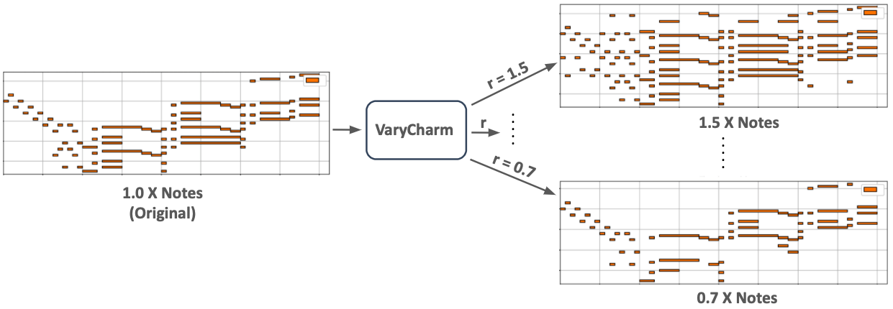

# VaryNote

<figure><figcaption>
Example process of altering the number of notes in symbolic music
</figcaption></figure>

Automatically varying the number of notes in symbolic music has various applications in assisting music creators to embellish simple tunes or to reduce complex music to its core idea. In this paper, we formulate the problem of varying music complexity, and propose a method that can preserve harmonic structure while varying the number of notes. Our method, VaryNote, adopts an autoencoder architecture in combination with a masking mechanism to control the number of notes of the generated music. To train the weights of the pitch autoencoder we present a novel surrogate divergence, combining the loss of pitch reconstructions with chord predictions end-to-end. We evaluate our results by plotting chord recognition accuracy with increasing and decreasing number of notes, analysing absolute and relative musical features with a probabilistic framework, and by conducting human surveys. The human survey results indicate humans prefer VaryNote output (with 1.5, 1.9 X notes) over the original music; suggesting that it can be a useful tool in music generation applications.\

**Project Page**



